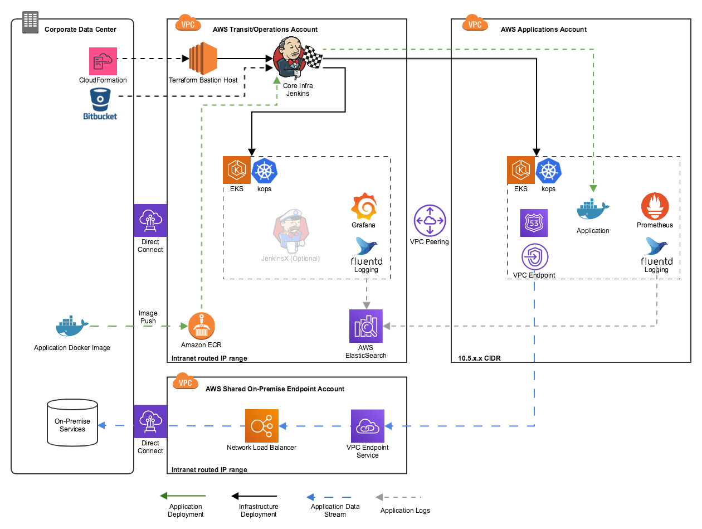

# Kentrikos Bootstrap for CloudHub-based environments

This repo serves as the entry-point for Kentrikos and to create an enterprise Cloud Hub environment with Kubernetes cluster(s) in the AWS cloud.  It contains all needed instructions to setup an automated environment where you can deploy your application in a Kubernetes cluster.

_Two flavors are offered:_  
* EKS  
* KOPS (Warning, currently Work in Progress)

   

**EKS** is a kubernetes cluster where the Control Plane are completely managed and operated by AWS (Only the worker nodes need to be managed).  
  
**KOPS** is a kubernetes cluster where all master and worker nodes are under your control and administration.

Both solutions offer the same compute power for your app on the worker nodes.  EKS will take the operational part of your master nodes out of your hands.

Please follow one of the following instruction to set up your environment:  

#### For EKS:    https://github.com/kentrikos/aws-bootstrap/blob/master/docs/EKS_README.md  

#### For KOPS (WIP):   https://github.com/kentrikos/aws-bootstrap/blob/master/docs/KOPS_README.md
